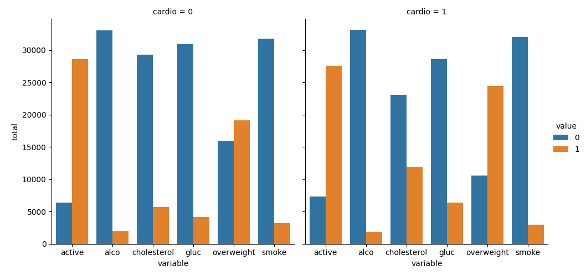
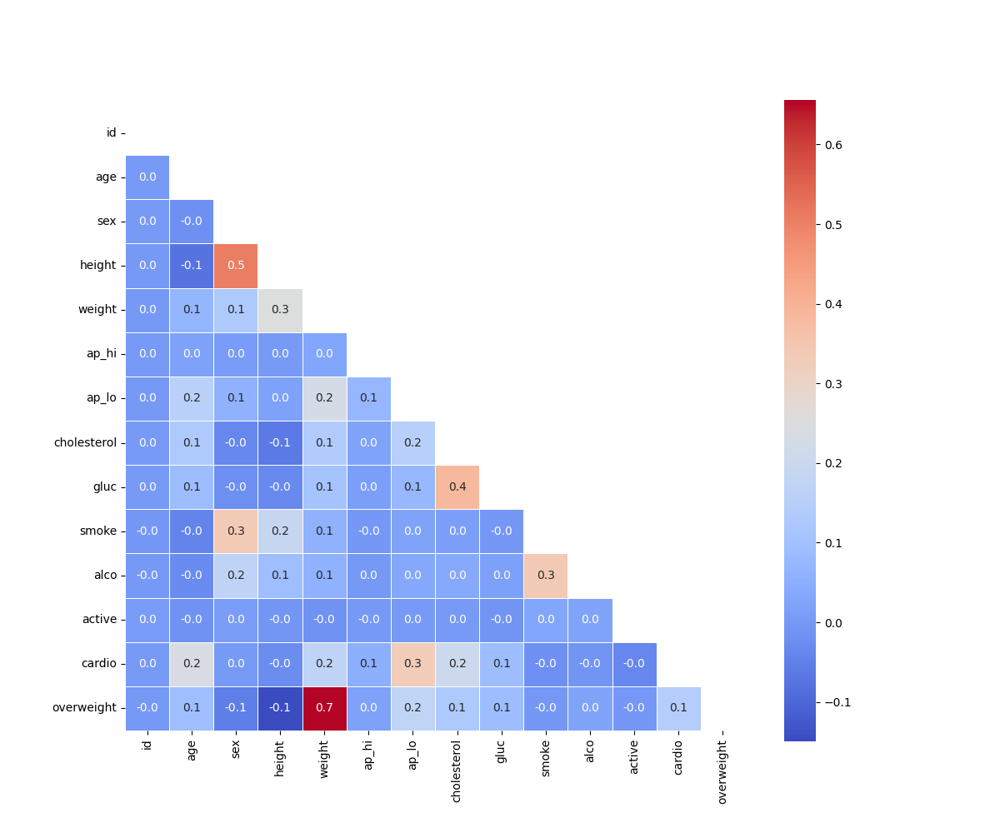

# 🏥 Medical Data Visualizer


Proyecto de **análisis y visualización de datos médicos** que examina la relación entre factores de riesgo cardiovascular — colesterol, glucosa, actividad física, obesidad, consumo de alcohol y tabaco — y la presencia de enfermedades cardíacas en una muestra de **70,000 pacientes**. El análisis produce dos visualizaciones complementarias que comunican patrones clínicos relevantes para la toma de decisiones en salud.

---

## 📌 Contexto Clínico

Las enfermedades cardiovasculares representan la principal causa de mortalidad a nivel mundial. Comprender qué factores de riesgo se asocian con mayor frecuencia a su presencia permite a los equipos clínicos y de salud pública diseñar estrategias de prevención más efectivas. Este proyecto responde a esa necesidad mediante:

- **Comparación de perfiles de riesgo** entre pacientes con y sin enfermedad cardiovascular
- **Identificación de correlaciones** entre variables biométricas y de estilo de vida
- **Visualización clara y reproducible** que puede integrarse en reportes clínicos o dashboards institucionales

---

## 🎯 Funcionalidades

El módulo `medical_data_visualizer.py` expone dos funciones principales:

### `draw_cat_plot()` — Gráfico Categórico por Factor de Riesgo
Genera un gráfico de barras que compara la distribución de 6 factores de riesgo entre pacientes **con** (`cardio = 1`) y **sin** (`cardio = 0`) enfermedad cardiovascular.

**Variables analizadas:** `active`, `alco`, `cholesterol`, `gluc`, `overweight`, `smoke`

### `draw_heat_map()` — Mapa de Calor de Correlaciones
Genera una matriz de correlación triangular inferior entre todas las variables del dataset, incluyendo la variable derivada `overweight`, con limpieza previa de datos clínicamente inconsistentes.

---

## 📊 Resultados y Hallazgos

### Gráfico Categórico por Cardiopatía



**Hallazgos clave por variable:**

| Variable | Pacientes sin cardiopatía (cardio=0) | Pacientes con cardiopatía (cardio=1) | Diferencia notable |
|----------|:------------------------------------:|:------------------------------------:|:-----------------:|
| **Colesterol elevado** | Menor proporción | **Mayor proporción** | ✅ Sí |
| **Glucosa elevada** | Menor proporción | **Mayor proporción** | ✅ Sí |
| **Sobrepeso** | ~16,000 afectados | **~24,500 afectados** | ✅ Sí |
| **Actividad física** | Mayor nivel | Menor nivel | ✅ Sí |
| **Alcohol** | Distribución similar | Distribución similar | ❌ No significativa |
| **Tabaco** | Distribución similar | Distribución similar | ❌ No significativa |

> Los factores con mayor diferencia entre grupos son **colesterol**, **glucosa** y **sobrepeso**, que muestran prevalencia notablemente más alta en pacientes con enfermedad cardiovascular. La **actividad física** actúa como factor protector, siendo menor en el grupo con cardiopatía.

---

### Mapa de Calor de Correlaciones



**Correlaciones más significativas identificadas:**

| Par de Variables | Correlación | Interpretación |
|-----------------|:-----------:|----------------|
| `height` ↔ `weight` | **0.5** | Correlación moderada positiva — esperada biométricamente |
| `weight` ↔ `overweight` | **0.7** | Correlación alta — el IMC depende directamente del peso |
| `cholesterol` ↔ `gluc` | **0.4** | Asociación entre niveles elevados de ambos marcadores |
| `smoke` ↔ `alco` | **0.3** | Co-ocurrencia de hábitos de riesgo |
| `ap_lo` ↔ `cholesterol` | **0.2** | Presión diastólica asociada al colesterol |
| `cardio` ↔ `cholesterol` | **0.3** | Colesterol como factor de riesgo cardiovascular |
| `cardio` ↔ `ap_lo` | **0.2** | Presión arterial diastólica asociada a cardiopatía |
| `height` ↔ `overweight` | **-0.1** | Relación inversa: mayor altura reduce probabilidad de IMC > 25 |

> La correlación más destacada del dataset es `weight ↔ overweight` (**0.7**), confirmando la coherencia del cálculo del IMC. La variable `cardio` muestra correlaciones positivas con `cholesterol` (0.3), `ap_lo` (0.2) y `gluc` (0.2), alineadas con la evidencia clínica.

---

## 📂 Dataset

**Archivo:** `medical_examination.csv` — **70,000 registros** de exámenes médicos de pacientes

| Variable | Tipo | Descripción |
|----------|------|-------------|
| `id` | Int | Identificador único del paciente |
| `age` | Int | Edad en días |
| `sex` | Binaria | 1 = Mujer, 2 = Hombre |
| `height` | Int | Altura en cm |
| `weight` | Float | Peso en kg |
| `ap_hi` | Int | Presión arterial sistólica |
| `ap_lo` | Int | Presión arterial diastólica |
| `cholesterol` | Ordinal | 1 = Normal, 2 = Elevado, 3 = Muy elevado |
| `gluc` | Ordinal | 1 = Normal, 2 = Elevado, 3 = Muy elevado |
| `smoke` | Binaria | 0 = No fuma, 1 = Fuma |
| `alco` | Binaria | 0 = No consume, 1 = Consume alcohol |
| `active` | Binaria | 0 = Sedentario, 1 = Activo físicamente |
| `cardio` | Binaria | **Target**: 0 = Sin cardiopatía, 1 = Con cardiopatía |
| `overweight` *(derivada)* | Binaria | 0 = IMC ≤ 25, 1 = IMC > 25 |

### Transformaciones aplicadas

```python
# Variable derivada: sobrepeso (IMC > 25)
df['overweight'] = (df['weight'] / ((df['height'] / 100) ** 2) > 25).astype(int)

# Normalización binaria: colesterol y glucosa
df['cholesterol'] = (df['cholesterol'] > 1).astype(int)  # 0=normal, 1=elevado
df['gluc'] = (df['gluc'] > 1).astype(int)                # 0=normal, 1=elevado

# Limpieza de datos clínicamente inválidos (para heatmap)
df_heat = df[
    (df['ap_lo'] <= df['ap_hi']) &                              # presión diastólica < sistólica
    (df['height'] >= df['height'].quantile(0.025)) &            # filtro percentil 2.5%
    (df['height'] <= df['height'].quantile(0.975)) &            # filtro percentil 97.5%
    (df['weight'] >= df['weight'].quantile(0.025)) &            # filtro percentil 2.5%
    (df['weight'] <= df['weight'].quantile(0.975))              # filtro percentil 97.5%
]
```

---

## 🗂️ Estructura del Proyecto

```
medical-data-visualizer/
├── medical_examination.csv       # Dataset de 70,000 pacientes
├── medical_data_visualizer.py    # Módulo principal con las funciones de visualización
├── main.py                       # Script de entrada y ejecución de tests
├── test_module.py                # Tests unitarios (CatPlot + HeatMap)
├── catplot.png                   # Gráfico categórico exportado
├── heatmap.png                   # Mapa de calor exportado
└── README.md
```

---

## 🧪 Tests Unitarios

El proyecto incluye un módulo de pruebas (`test_module.py`) con dos suites de tests que validan la correcta generación de las visualizaciones:

| Test | Descripción | Estado |
|------|-------------|:------:|
| `test_line_plot_labels` | Verifica etiquetas de ejes X e Y del catplot | ✅ Pass |
| `test_bar_plot_number_of_bars` | Verifica que el catplot tenga 13 barras | ✅ Pass |
| `test_heat_map_labels` | Verifica las 14 etiquetas del heatmap | ✅ Pass |
| `test_heat_map_values` | Verifica los 91 valores de correlación del heatmap | ✅ Pass |

---

## 🛠️ Stack Tecnológico

- **Python 3.8+**
- **Pandas** — carga, limpieza y transformación del dataset
- **NumPy** — cálculo del IMC y máscara triangular del heatmap
- **Seaborn** — `catplot` y `heatmap` con paletas y anotaciones
- **Matplotlib** — exportación de figuras en PNG
- **Unittest** — suite de tests de validación automatizados

---

## ⚙️ Instalación y Uso

**1. Clonar el repositorio**
```bash
git clone https://github.com/davallejo/medical-data-visualizer.git
cd medical-data-visualizer
```

**2. Instalar dependencias**
```bash
pip install -r requirements.txt
```

**3. Ejecutar el análisis y tests**
```bash
python main.py
```

**4. Usar las funciones individualmente**
```python
import medical_data_visualizer as mdv

# Generar gráfico categórico
fig_cat = mdv.draw_cat_plot()
fig_cat.savefig('catplot.png', dpi=150)

# Generar mapa de calor de correlaciones
fig_heat = mdv.draw_heat_map()
fig_heat.savefig('heatmap.png', dpi=150)
```

---

## 🗺️ Roadmap

- [ ] Agregar análisis estadístico inferencial (chi-cuadrado, p-values) para cada factor de riesgo
- [ ] Dashboard interactivo con Streamlit para exploración dinámica por segmento de edad y sexo
- [ ] Incorporar modelo predictivo de riesgo cardiovascular (Logistic Regression / Random Forest)
- [ ] Análisis de subgrupos por rango etario para identificar factores de riesgo por ciclo de vida
- [ ] Exportación de reporte PDF con hallazgos automatizados

---

## 📄 Licencia

Este proyecto está bajo la Licencia MIT. Consulta el archivo [LICENSE](LICENSE) para más detalles.

---

## 👤 Autor

**Diego Vallejo**

[](https://www.linkedin.com/in/ing-diego-vallejo)
[](https://github.com/davallejo)
[](https://davallejo.github.io/)

---

> *Análisis de datos clínicos orientado a la prevención cardiovascular — transformando registros de exámenes médicos en visualizaciones que revelan patrones de riesgo accionables para equipos de salud.*
